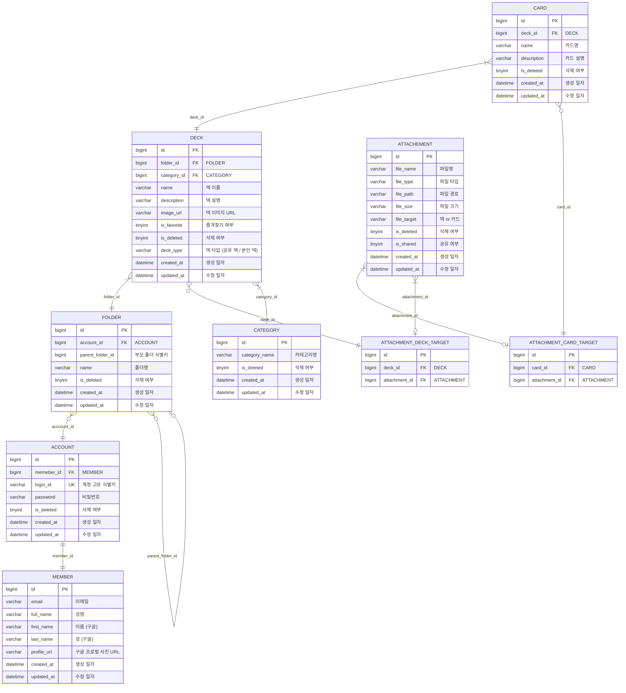

# edio_backend

> Edio 프로젝트 내 Backend 모듈

# 요구 사항

AI 기반 맞춤형 학습 지원 서비스 내 각종 API 제공

# 개발 환경

- Java 17
- spring-boot 3.3.4
    - spring-data-jpa
    - spring-security
    - oauth-client
- springdoc.swagger 2.6.0
- mysql

## 외부 주입 변수

**DB_USERNAME** : DB 접속 계정 정보  
**DB_PASSWORD** : DB 접속 비밀번호  
**DB_URL** : DB 접속 URL

**GOOGLE_CLIENT_ID** : google 로그인 관련 클라이언트 키
**GOOGLE_CLIENT_SECRET** : google 로그인 관련 시크릿 키

**JWT_SECRET** : JWT 토큰 발급용 해시 값

# API docs

[Swagger](http://ec2-43-203-169-54.ap-northeast-2.compute.amazonaws.com:8080/swagger-ui/index.html)

# 스키마 구조

[스키마.drawio](https://drive.google.com/file/d/1lzDTaKRvREPghpfdLgRk63Ca7JFktPcs/view?usp=sharing)

